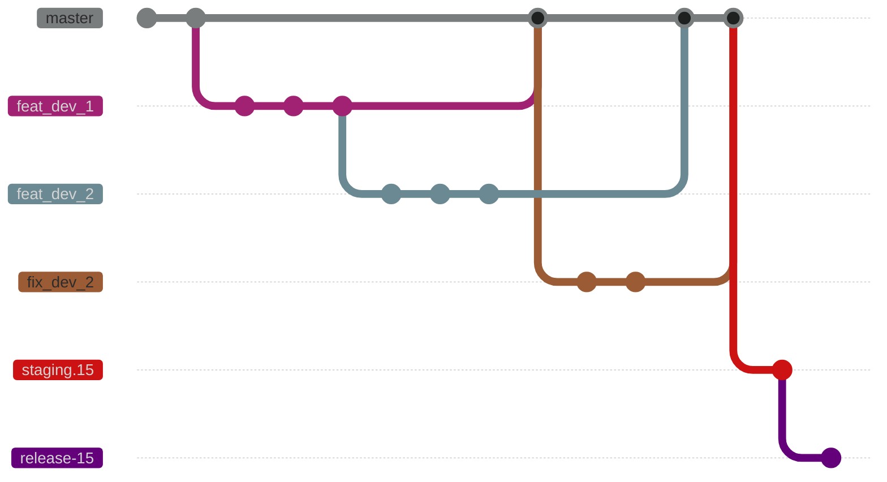

# Estándares de Git

En esta seccion se muestran el flujo de trabajo para el manejo de git dentro de los proyectos Integra v16 y de terceros

### Flujo de trabajo



Aspectos a tomar en cuenta

- Las ramas staging-X y release-X seran ramas bloqueadas para push
- La rama master sera la rama de desarrollo, una vez que se haga un release, la rama master empezara a recibir codigo del siguiente release

## Commits

### Titulo

```bash
TAG: module_name : descripcion breve
```
#### Tags

- `FEAT` Nuevas implementaciones
- `FIX` Arreglos a bugs
- `HOTFIX` Arreglos a bugs de forma inmediata a ramas release
- `WIP` Tareas en progreso, no culminadas
- `ADD` Añadir un modulo
- `MERGE`
- `IMP` Mejoras
- `REF` Refactorizacion
- `REM` Elminar archivos
- `I18N` Traducciones
- `REL` RELEASE 

### Contenido
Se debe explicar en el contenido del commit en el siguiente orden

```
Que estaba sucediendo o el problema

Como se soluciono y que se implemento, con su configuracion

Referencia a tarea o pull request 
```


## Pull Request

### Titulo 

Debido a que integra tiene implementado actions para realizar pruebas, en los pull request se tiene un estandard para que puedan correr dichos github actions.

```bash
TAG: Descripcion breve {model_name,model_name_two} [module_one,module_two]
```
#### Ejemplo

```bash
FEAT: Pruebas unitarias de retenciones de IVA de proveedor {iva_retention} [l10n_ve,binaural_payment_extension]
```

#### Todos los pull request deben pasar las pruebas unitarias y de odoo, incluyendo la aprobacion del equipo autorizado
