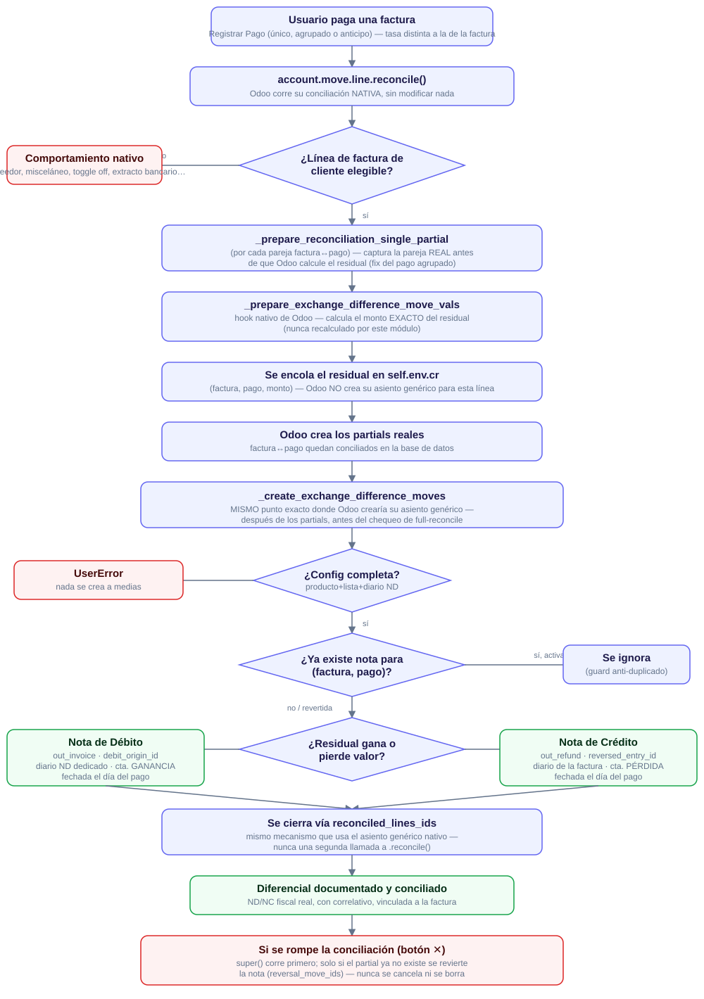

=====================================================
Venezuela - Diferencial Cambiario como Notas de Débito/Crédito
=====================================================

.. |badge1| image:: https://img.shields.io/badge/licence-LGPL--3-blue.png
    :target: http://www.gnu.org/licenses/lgpl-3.0-standalone.html
    :alt: License: LGPL-3

|badge1|

Este módulo documenta el diferencial cambiario que surge al conciliar una
factura de cliente en moneda extranjera contra un pago con una tasa de
cambio distinta, usando Notas de Débito/Crédito **fiscales reales** (con
correlativo, vinculadas a la factura de origen) en vez del asiento contable
genérico e interno que Odoo crea por defecto.

Cómo funciona
"""""""""""""

1. Al conciliar la línea de cuenta por cobrar de una o varias facturas de
   cliente contra la de uno o varios pagos (incluye conciliaciones
   agrupadas, ej. un pago único aplicado a varias facturas), este módulo
   NO desactiva ni reemplaza el mecanismo nativo de diferencial cambiario
   de Odoo -- la conciliación en sí corre exactamente igual que sin el
   módulo instalado. El diferencial se calcula y documenta por separado
   para CADA factura involucrada, nunca solo para la primera.

2. El monto exacto del diferencial se obtiene interceptando
   ``_prepare_exchange_difference_move_vals``, el método interno que el
   propio motor de conciliación de Odoo invoca para calcular el residual
   exacto que necesita corregir (contra la tasa ORIGINAL de
   contabilización de cada línea, no una aproximación independiente).
   Este módulo no recalcula ese monto por su cuenta -- toma el valor que
   Odoo ya determinó como correcto y, en vez de dejar que se destine al
   asiento genérico interno, lo redirige a una ND/NC fiscal real. Esto
   funciona sin importar si factura y pago comparten la misma moneda
   extranjera, o si uno de los dos está en moneda de compañía (Bs).

3. Con ese monto se emite, fechada el día del PAGO (no el día en que corre
   la conciliación):

   - Una **Nota de Débito** (ganancia cambiaria) si el residual quedó del
     lado del crédito -- vinculada a la factura mediante ``debit_origin_id``,
     posteada en el diario dedicado de ND (``is_debit=True``, con su
     secuencia propia asignada) y en la cuenta de GANANCIA cambiaria de
     la compañía (``income_currency_exchange_account_id``). Si no hay
     ningún diario así configurado -- o le falta la secuencia -- la
     conciliación falla con un ``UserError`` claro en vez de caer en
     silencio al diario de venta de la factura (eso numeraría la ND con
     la secuencia de FACTURAS, un documento fiscal distinto).
   - Una **Nota de Crédito** (pérdida cambiaria) si el residual quedó del
     lado del débito -- vinculada a la factura mediante ``reversed_entry_id``,
     posteada en el MISMO diario de venta de la factura de origen (Odoo ya
     numera notas de crédito con ``refund_sequence_id`` en cualquier diario,
     no hace falta uno dedicado) y, con cuenta EXPLÍCITA en la línea, en la
     cuenta de PÉRDIDA cambiaria de la compañía
     (``expense_currency_exchange_account_id`` -- sin este override, Odoo
     usaría la cuenta de ingreso del producto también para la NC, ya que
     ``is_sale_document()`` trata factura y nota de crédito de cliente por
     igual al resolver la cuenta de la línea).

   Ambas quedan además vinculadas explícitamente vía
   ``l10n_ve_exchange_invoice_id`` (factura) y ``l10n_ve_exchange_payment_id``
   (pago que la originó), y se concilian de inmediato para cerrar el
   residual por completo. Si dos conciliaciones casi simultáneas afectan la
   misma factura CON el mismo pago, solo se emite una ND/NC -- la segunda
   detecta que ya existe una para ese par (factura, pago) y no duplica el
   documento. Una factura pagada en varias cuotas SÍ puede acumular una
   ND/NC distinta por cada cuota, cada una con su propio diferencial.

4. Si la conciliación factura-pago que originó la nota se rompe
   (botón "✕" del widget de pagos), la nota **no se cancela ni se borra**
   -- ya es un documento fiscal posteado con correlativo real. En su lugar
   se revierte automáticamente (Nota de Crédito revierte una Nota de
   Débito, y viceversa), igual que hace Odoo con su propio asiento
   genérico de diferencial al desconciliar. Intentar desconciliar la
   propia nota directamente (sin pasar por la conciliación original) está
   bloqueado.

5. Este comportamiento **solo aplica a documentos de cliente con
   ``move_type`` igual a** ``out_invoice`` **o** ``out_refund``. Esto
   incluye tanto facturas normales como Notas de Débito de cliente
   nativas (``out_invoice`` con ``debit_origin_id``, ya que Odoo las
   trata como una factura más), y tanto notas de crédito normales como
   la propia Nota de Crédito que emite este módulo. Cualquier otro caso
   (facturas de proveedor, asientos manuales, compañías con el modo
   desactivado) sigue el comportamiento nativo de Odoo, sin
   modificaciones -- incluyendo su propio asiento genérico de
   diferencial, que de todas formas queda etiquetado
   (``l10n_ve_exchange_diff_entry``) para identificarlo.

Configuración
"""""""""""""

* Compañía (``res.company``), en ``Ajustes > Contabilidad``:

  * Usar Notas de Débito/Crédito para diferencial cambiario (activable/desactivable).
  * Producto de Nota de Diferencial Cambiario (debe tener un impuesto exento configurado).
  * Lista de Precios de Nota de Diferencial Cambiario -- requerida por el
    módulo ``account_invoice_pricelist`` (toda factura/nota necesita una
    en su propia moneda). Debe estar en la moneda de la compañía, nunca
    en moneda extranjera -- estas notas siempre se emiten en moneda de
    compañía.
  * Con el toggle activado, tanto el producto como la lista de precios
    son OBLIGATORIOS -- la compañía no se puede guardar sin ambos
    configurados (``_check_l10n_ve_exchange_use_nd_nc_requires_config``).

* Diario de venta (``account.journal``):

  * ``Es Débito`` activado, con su secuencia dedicada para las Notas de
    Débito de diferencial cambiario asignada -- ambos son obligatorios
    para poder emitir una ND (ver Limitaciones).

Limitaciones
""""""""""""

* Solo cubre documentos de **cliente** con ``move_type in
  ('out_invoice', 'out_refund')`` -- incluye Notas de Débito de cliente
  nativas, ya que Odoo las trata como ``out_invoice``. Facturas de
  proveedor y otros documentos no se ven afectados por este módulo.
* Requiere el producto y la lista de precios de diferencial cambiario
  configurados (validado al guardar la compañía, y de nuevo en tiempo de
  conciliación como defensa en profundidad) -- si falta cualquiera, la
  conciliación falla con un error claro en vez de dejar una nota
  incompleta. Para la rama de GANANCIA (ND) además se exige el diario
  dedicado con su secuencia propia.
* Una factura en moneda de compañía (Bs) no tiene exposición cambiaria
  real -- su monto no fluctúa con la tasa -- pero SÍ puede generar una
  ND/NC si se paga en moneda extranjera: Odoo calcula un residual de
  redondeo de la conversión sobre esa línea (comportamiento nativo,
  confirmado en el código fuente del núcleo), y este módulo lo documenta
  igual que cualquier otro diferencial de una factura de cliente, sin
  excepción.
* Compatible con IGTF (``l10n_ve_igtf``): ambos ajustes son independientes
  entre sí sobre la misma conciliación.
* En un pago AGRUPADO (un solo pago liquidando varias facturas a la
  vez), si Odoo atribuye el residual al lado del PAGO en vez de a la
  factura (típico en la dirección de ganancia) y hay MÁS de una factura
  candidata en ese mismo pago, este módulo determina la factura exacta
  de cada residual sobrescribiendo
  ``_prepare_reconciliation_single_partial`` para capturar la pareja
  REAL (factura, pago) de cada partial antes de que Odoo calcule el
  residual -- nunca adivina por orden de aparición. La nota siempre se
  crea, se vincula a la factura correcta, y se cierra cruzando contra el
  pago.
* **Widget de Conciliación Bancaria (Odoo Enterprise, `account_accountant`)**:
  cuando se empareja una línea de extracto bancario directamente contra
  una factura desde ese widget, es un flujo completamente legítimo y
  normal -- este módulo no lo prohíbe ni lo evita, y no hay que rodearlo
  de ninguna forma especial. Simplemente NO pasa por la lógica de este
  módulo, por una razón distinta a "la contraparte no es una cuenta por
  cobrar": el widget (``account.bank.statement.line._reconcile_payments``,
  en ``account_accountant``) calcula el ajuste de diferencial cambiario
  **él mismo**, y lo aplica directo sobre el balance de la línea antes
  de crearla (``_lines_get_account_balance_exchange_diff`` +
  ``_add_move_line_to_statement_line_move``, con
  ``no_exchange_difference_no_recursive``) -- nunca llama
  ``account.move.line.reconcile()`` en absoluto, así que ni siquiera
  pasa por el mecanismo nativo de Odoo que este módulo intercepta
  (``_prepare_exchange_difference_move_vals``). No se genera un asiento
  de diferencial separado, genérico ni propio: el ajuste queda
  incorporado directamente en la propia línea de conciliación del
  extracto. Esto es estructural al widget de Enterprise, no algo que
  este módulo pueda interceptar sin reimplementar esa lógica.
* El hook de este módulo engancha ``account.move.line.reconcile()``, no
  ``_reconcile_plan()`` (el motor de conciliación de más bajo nivel que
  ``reconcile()`` invoca por debajo). **Cualquier desarrollo propio de
  Binaural debe conciliar facturas de cliente siempre a través de
  `reconcile()`**, nunca llamando `_reconcile_plan()` directamente ni
  saltándose el flujo estándar por algún atajo -- no se puede controlar
  ni prever qué otras integraciones externas podrían invocar
  `_reconcile_plan()` directamente (evitando este hook por completo),
  pero el código de Binaural sí está bajo nuestro control y debe
  respetar esta vía siempre. Cuando `_reconcile_plan()` se invoca
  directamente (por control ajeno, o el widget de Enterprise descrito
  arriba), degrada de forma segura para la CONTABILIDAD (Odoo resuelve
  el diferencial por su cuenta, nada se rompe, no hay pérdida de
  dinero) pero NO para el OBJETIVO del módulo: no sale la ND/NC fiscal
  real que se supone debe emitirse. Cualquier código propio de Binaural
  que termine reconciliando facturas de cliente por una vía distinta a
  `reconcile()` está, de hecho, rompiendo el propósito de este módulo,
  aunque no rompa la contabilidad.
* Una factura liquidada en varias cuotas puede acumular más de una ND/NC
  (una por cuota), cada una con el monto EXACTO que el propio motor de
  conciliación de Odoo calculó para esa cuota
  (``_prepare_exchange_difference_move_vals``, siempre contra la tasa
  ORIGINAL de contabilización de la factura, sin importar la tasa de
  cuotas anteriores). Este módulo no recalcula ese monto de forma
  independiente -- solo intercepta el valor que Odoo ya determinó y lo
  redirige a la ND/NC en vez de al asiento genérico. Cada nota, sea ND o
  NC, queda cerrada de inmediato contra la línea (factura o pago) cuyo
  residual originó el diferencial.

**Tabla de Contenidos**

.. contents::
   :local:

Créditos
========

Autor/es
~~~~~~~~

* Binauraldev

Mantenedor/es
~~~~~~~~~~~~~

Este módulo es mantenido por Binaural.

.. image:: https://binauraldev.com/wp-content/uploads/2022/01/logo-binaural.png
   :alt: Binaural dev
   :target: https://binauraldev.com/
